# Elderly Care Monitoring System

<!-- First Section -->

## Team Details

  
Detail

> Semester: 3rd Sem B. Tech. CSE

> Section: S1

> Member-1: Aayushman, 231CS105, aayushman.231cs105@nitk.edu.in

> Member-2: Atharva Parkhi, 231CS115, aparkhi.231cs115@nitk.edu.in

> Member-3: Sahil Mengji, 231CS151, sahilmengji.231cs151@nitk.edu.in

<!-- Second Section -->

## Abstract

  
Detail

  
  > The motivation for developing an Elderly Care Monitoring System arises from the
pressing need to ensure the safety and well-being of the aging population, especially those
living independently. Real-time health monitoring solutions can detect critical conditions
like abnormal heart rates, high temperatures, and falls, reducing health risks. Further-
more, managing multiple medications can be challenging for seniors, so incorporating a
medicine reminder feature helps ensure timely intake and prevents missed doses. This
system provides peace of mind for caregivers, enabling timely medical intervention and
better health management.  
The growing elderly population faces significant challenges in health management and
safety. Many seniors struggle to monitor vital health parameters, leading to unnoticed
risks. The complexity of medication regimens can result in missed doses, jeopardizing
their well-being. This project aims to create a comprehensive system that integrates
health monitoring, fall detection, and medication reminders, along with a fall recovery
timer to track recovery times after falls. This enhances safety, ensures timely assistance,
and improves the quality of life for elderly individuals living independently.   
Here are the features of the Elderly Care Monitoring System: 
~ Real-Time Health Monitoring: Continuously tracks vital parameters such as heart
rate and body temperature, providing immediate alerts for abnormalities. 
~ Error-free Fall Detection Mechanism: Quickly identifies falls and notifies caregivers
at the same time avoiding any false alarms using a robust recovery timer system and
debouncing system, ensuring prompt assistance in emergencies. 
~ Medicine Reminder System: Alerts seniors when to take their medications, prevent-
ing missed doses and promoting adherence to medication schedules.

<!-- Third Section -->
## Block Diagram

  
Detail

> 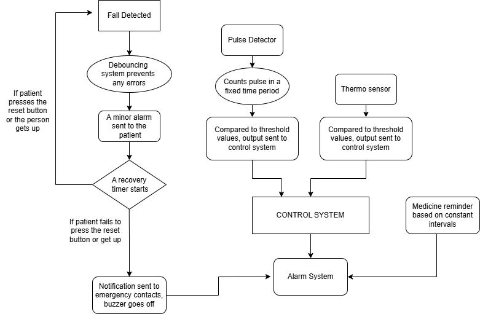

## Working

  
Detail

> The Elderly Monitoring System is designed to assist in the continuous health and safety monitoring of elderly individuals. It integrates multiple modules, each serving a specific function to enhance the well-being and daily life of the user. The system consists of the following core components:  

> 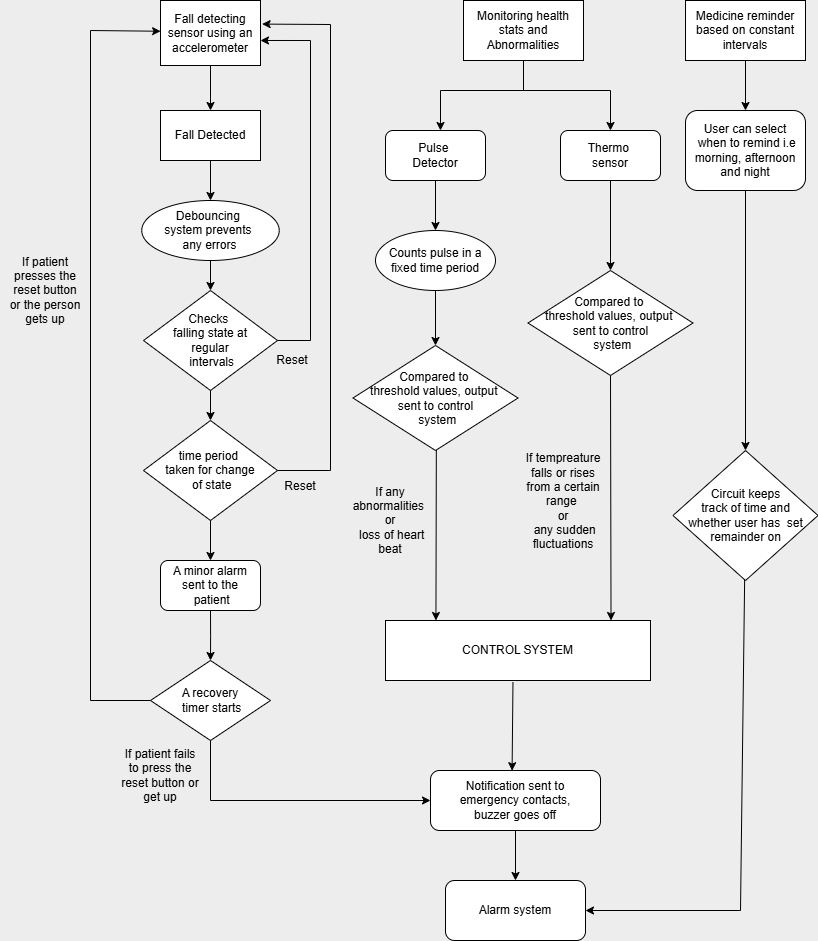  

 Control System: It is used to identify what module we are interested in looking at a particular instance between BPM monitoring and Temperature monitoring. It is made using a simple finite state machine, which contains three states: BPM monitoring, Temperature monitoring and Idle State which is accomplished using D flip flops. 

> 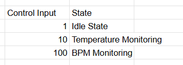  

 
BPM Monitoring: This module tracks the user's heart rate (beats per minute). It triggers an alert if the BPM falls outside the normal range, helping detect any irregularities in real-time. 

It contains a simple  structure in which we measure beats per minute of a person. In our case, we measure it for 10 seconds using a counter and a mono pulse button, thus giving the pulse manually, and multiply it by 6 using a multiplier thus getting it for a minute. Then that value is compared to certain threshold values determined for a person of old age using a comparator and if the measured values doesn't lie in the particular slot then the monitor returns an abnormal state. It also shows the current BPM of the patient.  

> 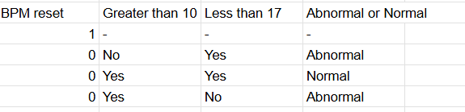  

Temperature Monitoring: This module measures the user's body temperature and monitors for abnormal fluctuations. If the temperature deviates from a healthy range, an alert is activated to prompt immediate action. Special handling is included to ensure no false alerts when the sensor detects a reading of zero.  

So the temperature is detected using a sensor, and if it falls below or above certain threshold values determined for old age people which is compared in our circuits using comparators, then it is an abnormality and it shows on the LED or output generated.  

> 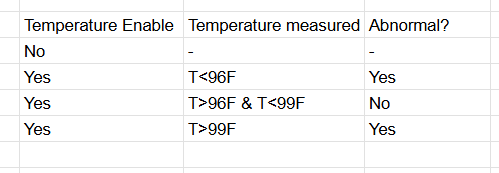  
Medicine Reminder: The medicine reminder module is programmed to provide timely alerts to the user when it's time to take their medication. This helps ensure adherence to prescribed medication schedules.  

At certain intervals, the patient gets a reminder for taking his/her medicines, which is executed using a simple counter and timer circuits.   

Fall Detection System: The fall detection system monitors for any sudden movements or lack of movement that could indicate a fall. In the event of a detected fall, the system sends an immediate alert to caregivers or family members, ensuring a quick response. 

This intricate system includes a debouncing system which ensures that no noisy signals pass through in the circuit and only stable signals do. This is done using D flip flops. When a stable signal reaches the system, a recovery timer starts executed using a counter thus allowing the user to reset the timer if the fall isn't serious. The reset button is executed using S flip flop. If the patient fails to press the reset button before the recovery timer ends, then an alarm is sent.  

> 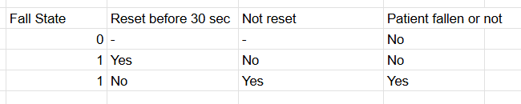  

<!-- Fourth Section -->

## Logisim Circuit Diagram

  
Detail

This is the main circuit diagram of our Elderly Care Monitoring System, which contains the following modules:
  BPM Monitor 
  Temperature Monitor 
  Fall Detection System 
  Medicine Reminder 
  Control System 
  
>  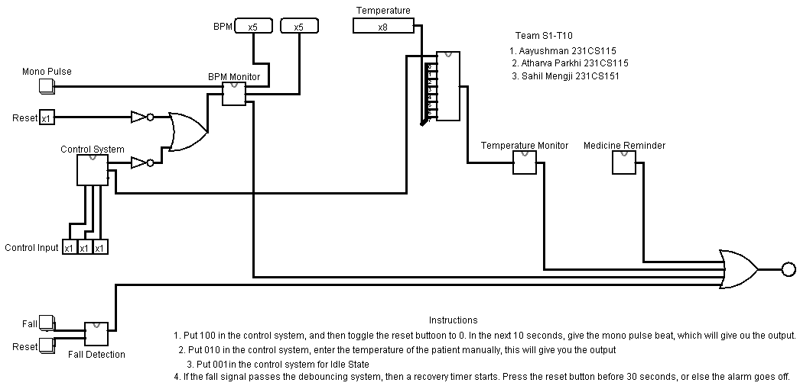    
  BPM Monitor takes pulses of the patient and returns whether it is abnormal or normal.
> 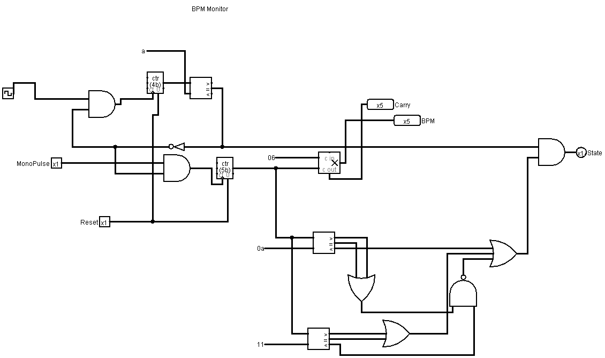    
  Temperature Monitor takes temperature of the patient and returns  whether it is abnormal or normal.
> 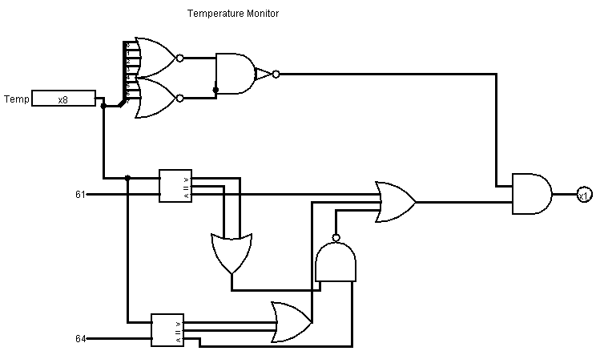   
  Fall detection system detects a fall, which passes through a debouncing system and starts a recovery timer which sends an alert after 30 seconds if it is not reset.
> 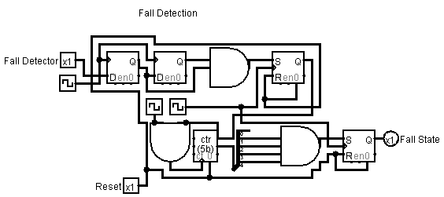   
  Medicine Reminder helps the patient to avoid missing any doses of their prescribed medication, thus taking care of their health.
> 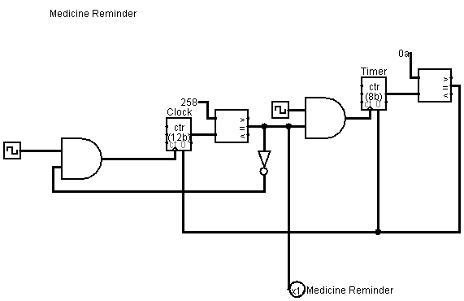   
  COntrol System helps to decide which state are we currently on.
> 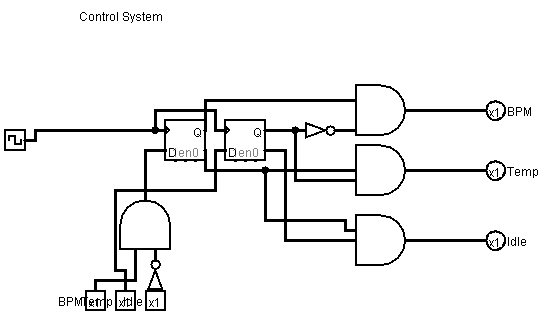   

<!-- Fifth Section -->

## Verilog Code

  
Detail

[Verilog File(Gate Level)](Verilog/S1-T10-Gate.v) 
[Verilog File (Data Flow Level)](Verilog/S1-T10.v) 
[Testbench File](Verilog/S1-T10_tb.v) 
> 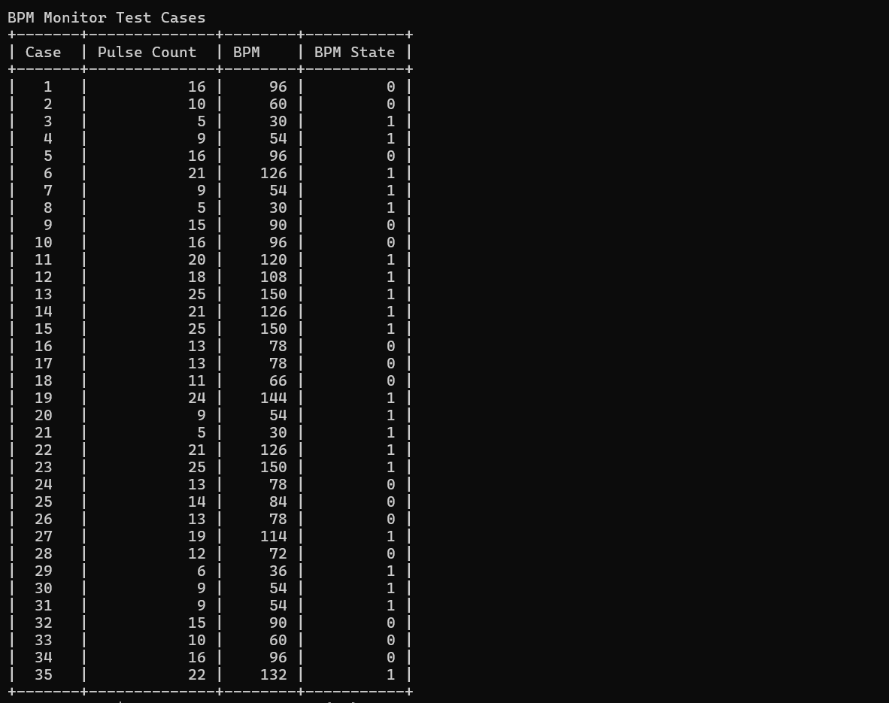   
> 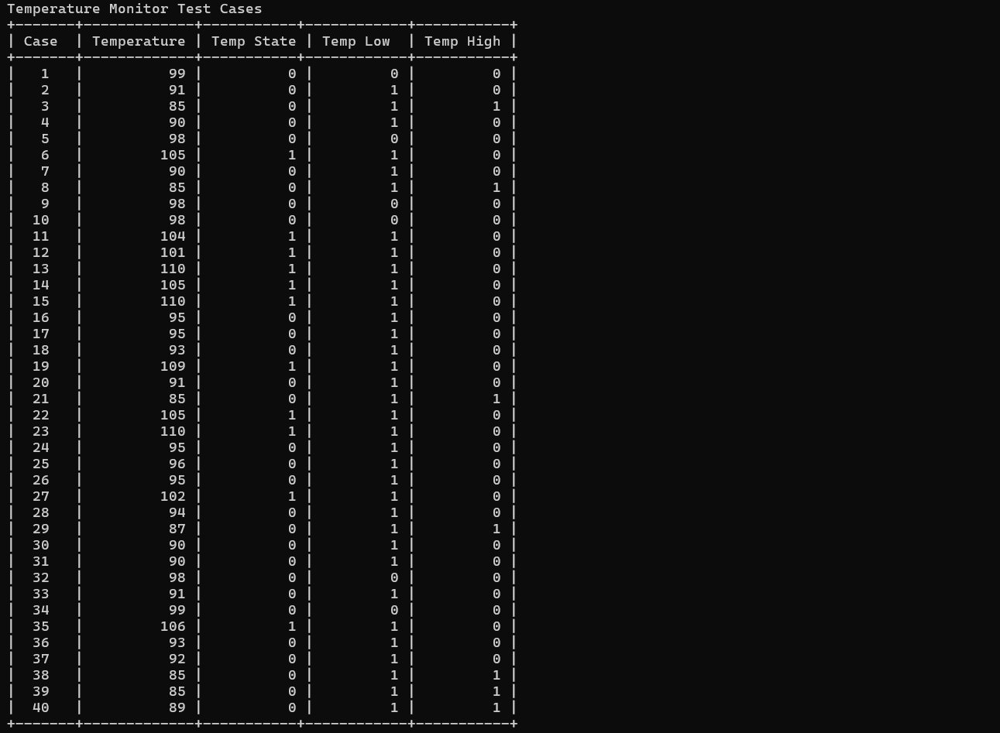   
> 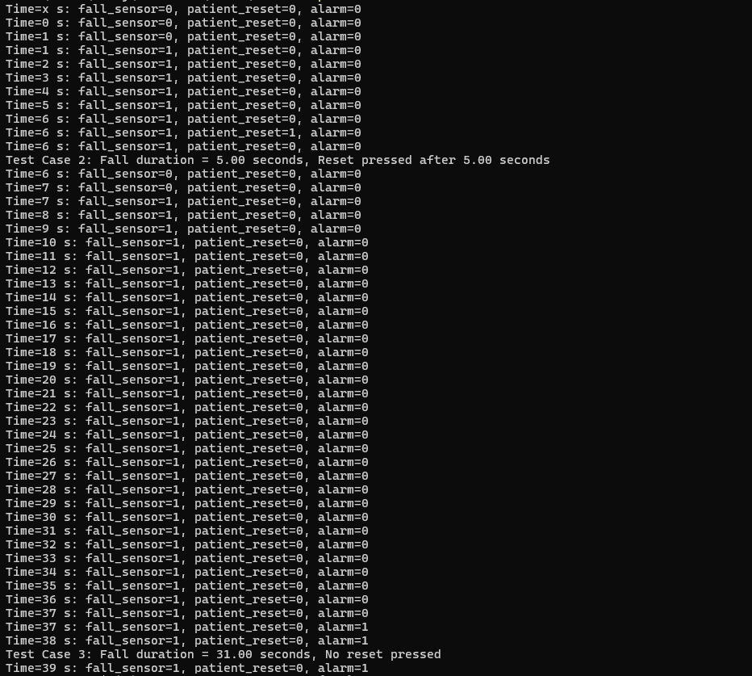   
> 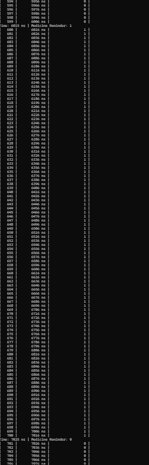   

## References

  
Detail

> http://www.csroc.org.tw/journal/JOC24-2/JOC24-2-1.pdf 
https://www.safewise.com/what-is-fall-detection/ 
https://blogs.worldbank.org/en/health/health-systems-must-address-unique-needs-aging-populations 
